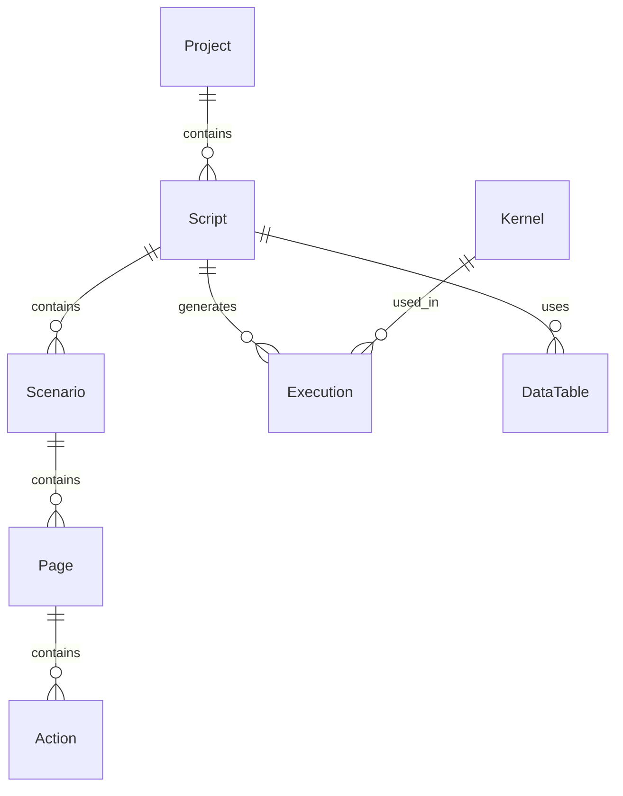

# Data Model: TraceForge Desktop

**Date**: 2025-12-16
**Feature**: 001-traceforge-desktop

## Entity Relationships

## Core Entities

### Project
**Purpose**: Logical container for organizing scripts and tracking versions
**Key Attributes**:
- `id`: UUID (primary key)
- `name`: String (user-defined project name)
- `version`: String (semantic versioning, e.g., "1.0.0")
- `description`: String? (optional project description)
- `created_at`: Timestamp
- `updated_at`: Timestamp
- `sync_enabled`: Boolean (whether to sync with server)
- `last_sync_at`: Timestamp? (when last synchronized)

**Validation Rules**:
- name must be unique per user
- version follows Semantic Versioning (MAJOR.MINOR.PATCH)
- created_at < updated_at

**State Transitions**:
- Created → Active → Archived
- Active → Synced (when server sync successful)
- Archived projects are read-only

---

### Script
**Purpose**: Automation test with hierarchical structure and metadata
**Key Attributes**:
- `id`: UUID (primary key)
- `project_id`: UUID (foreign key → Project.id)
- `name`: String (script name)
- `version`: String (script version)
- `priority`: Enum (P0, P1, P2)
- `description`: String? (optional)
- `created_at`: Timestamp
- `updated_at`: Timestamp
- `last_executed_at`: Timestamp? (last run time)
- `status`: Enum (ACTIVE, DRAFT, ARCHIVED)

**Relationships**:
- belongs to one Project
- contains multiple Scenarios
- has multiple Executions
- uses one DataTable (optional)

**Validation Rules**:
- name must be unique within a project
- version follows Semantic Versioning
- priority determines execution order in batch runs

**State Transitions**:
- DRAFT → ACTIVE (after first save)
- ACTIVE → ARCHIVED (manual or auto-archive after inactivity)
- Archived scripts cannot be executed

---

### Scenario
**Purpose**: Business process flow grouping related pages
**Key Attributes**:
- `id`: UUID (primary key)
- `script_id`: UUID (foreign key → Script.id)
- `name`: String (scenario name, e.g., "User Login Flow")
- `priority`: Enum (P0, P1, P2)
- `description`: String? (optional)
- `order_index`: Integer (display order within script)

**Relationships**:
- belongs to one Script
- contains multiple Pages
- inherits priority from parent Script by default, can override

**Validation Rules**:
- name must be unique within a script
- order_index must be non-negative integer
- can be reordered by changing order_index

---

### Page
**Purpose**: Logical grouping of actions representing a single URL or application state
**Key Attributes**:
- `id`: UUID (primary key)
- `scenario_id`: UUID (foreign key → Scenario.id)
- `name`: String (page name, e.g., "Login Page")
- `entry_url`: String? (URL to navigate to)
- `default_wait`: Enum? (load, networkidle, domcontentloaded)
- `order_index`: Integer (display order within scenario)

**Relationships**:
- belongs to one Scenario
- contains multiple Actions
- can reference entry_url for auto-navigation

**Validation Rules**:
- name must be unique within a scenario
- entry_url must be valid URL if provided
- order_index must be non-negative integer

---

### Action
**Purpose**: Individual test step (click, fill, assert, etc.)
**Key Attributes**:
- `id`: UUID (primary key)
- `page_id`: UUID (foreign key → Page.id)
- `name`: String (action name, auto-generated or user-defined)
- `action_type`: Enum (navigate, click, fill, hover, wait, assert, screenshot, scroll, keyboard)
- `order_index`: Integer (execution order within page)
- `timeout_ms`: Integer (default 30000)
- `wait_after`: String? (wait condition after action, e.g., "selector_visible:.dashboard")
- `screenshot_enabled`: Boolean (capture screenshot after action)

**Relationships**:
- belongs to one Page
- has multiple LocatorStrategies (ordered by priority)
- has multiple Parameters

**Validation Rules**:
- action_type determines required parameters
- timeout_ms must be positive integer
- order_index must be non-negative integer
- LocatorStrategies must include at least one for non-navigate actions

---

### LocatorStrategy
**Purpose**: Element identification methods with fallback priority
**Key Attributes**:
- `id`: UUID (primary key)
- `action_id`: UUID (foreign key → Action.id)
- `locator_type`: Enum (role, text, css, xpath, id)
- `value`: String (locator value, e.g., "button[name='Login']")
- `priority`: Integer (1 = highest priority)
- `is_fallback`: Boolean (alternative if higher priority fails)
- `description`: String? (optional note about locator)

**Relationships**:
- belongs to one Action
- ordered by priority within action

**Validation Rules**:
- locator_type determines value format validation
- priority must be positive integer
- value cannot be empty
- At least one locator required per action (except navigate)

---

### Parameter
**Purpose**: Dynamic values for actions (URLs, input text, etc.)
**Key Attributes**:
- `id`: UUID (primary key)
- `action_id`: UUID (foreign key → Action.id)
- `key`: String (parameter name, e.g., "url", "text", "input_value")
- `value`: String (parameter value or {{variable}} syntax)
- `data_type`: Enum (string, number, boolean, url, variable)

**Relationships**:
- belongs to one Action

**Validation Rules**:
- key must be unique per action
- value format depends on data_type
- variables use {{variable_name}} syntax

---

### Execution
**Purpose**: Record of a script run instance
**Key Attributes**:
- `id`: UUID (primary key)
- `script_id`: UUID (foreign key → Script.id)
- `kernel_id`: UUID (foreign key → Kernel.id)
- `status`: Enum (PASS, FAIL, SKIP, RUNNING)
- `started_at`: Timestamp
- `completed_at`: Timestamp? (null if still running)
- `duration_ms`: Integer (calculated: completed_at - started_at)
- `data_row_index`: Integer? (for data-driven executions)
- `trace_path`: String? (path to trace.zip file)
- `error_message`: String? (error details if failed)

**Relationships**:
- belongs to one Script
- belongs to one Kernel
- has many ExecutionSteps (one per Action)

**Validation Rules**:
- started_at must be before completed_at
- duration_ms calculated automatically
- status RUNNING → PASS/FAIL/SKIP only

---

### ExecutionStep
**Purpose**: Result of individual action execution
**Key Attributes**:
- `id`: UUID (primary key)
- `execution_id`: UUID (foreign key → Execution.id)
- `action_id`: UUID (foreign key → Action.id)
- `status`: Enum (PASS, FAIL, SKIP)
- `started_at`: Timestamp
- `completed_at`: Timestamp
- `duration_ms`: Integer
- `screenshot_path`: String? (path to step screenshot)
- `log_output`: String? (console logs from this step)
- `error_message`: String? (step-specific error)

**Relationships**:
- belongs to one Execution
- references one Action

**Validation Rules**:
- timestamps must be within parent execution timeframe
- duration_ms calculated automatically

---

### Kernel
**Purpose**: Chrome browser configuration for recording and execution
**Key Attributes**:
- `id`: UUID (primary key)
- `name`: String (user-friendly name, e.g., "Chrome 86")
- `executable_path`: String (path to chrome.exe)
- `version`: String (detected from executable)
- `is_compatible`: Boolean (version ≥ 86.0.4240.198)
- `is_default_record`: Boolean (default for recording)
- `is_default_agent`: Boolean (default for agent execution)
- `status`: Enum (ACTIVE, INACTIVE, ERROR)
- `added_at`: Timestamp
- `last_tested_at`: Timestamp? (when compatibility verified)

**Validation Rules**:
- executable_path must point to valid Chrome binary
- version must be ≥ 86.0.4240.198
- Only one kernel can be default per usage type (record/agent)

---

### DataTable
**Purpose**: Data source for data-driven testing
**Key Attributes**:
- `id`: UUID (primary key)
- `script_id`: UUID (foreign key → Script.id)
- `name`: String (table name)
- `source_type`: Enum (CSV, EXCEL, MANUAL)
- `file_path`: String? (path to CSV/Excel file)
- `columns`: JSON (array of column names)
- `created_at`: Timestamp
- `updated_at`: Timestamp

**Relationships**:
- belongs to one Script
- has many DataRows

**Validation Rules**:
- source_type determines required fields
- columns must be non-empty array
- file_path must be valid if source_type is CSV/EXCEL

---

### DataRow
**Purpose**: Individual data row for parameterized execution
**Key Attributes**:
- `id`: UUID (primary key)
- `data_table_id`: UUID (foreign key → DataTable.id)
- `row_index`: Integer (0-based index)
- `values`: JSON (column_name → value mapping)

**Relationships**:
- belongs to one DataTable

**Validation Rules**:
- row_index must be unique per DataTable
- values keys must match DataTable.columns

---

## Database Schema Migration Strategy

**Initial Schema**:
1. Create projects table
2. Create kernels table (standalone)
3. Create scripts table
4. Create scenarios, pages, actions tables (hierarchical)
5. Create locator_strategies, parameters tables
6. Create executions, execution_steps tables
7. Create data_tables, data_rows tables

**Migration History**:
- v1.0.0: Initial schema creation
- Future migrations for new features (sync support, visual regression baselines, etc.)

**Pruning Strategy**:
- Archive executions older than 1 year (configurable)
- Delete execution screenshots older than 6 months
- Keep execution metadata for historical reporting
